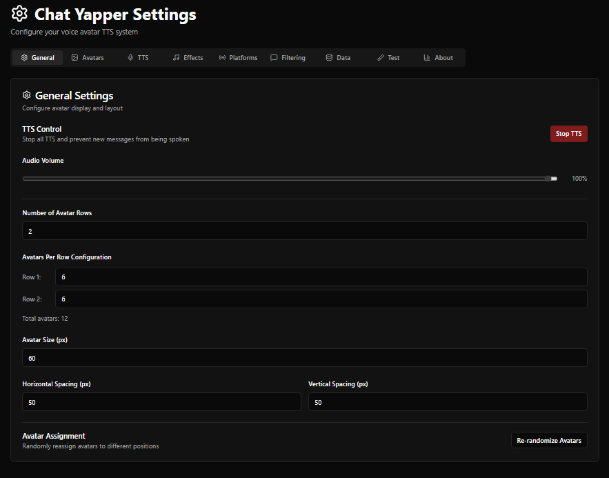

# Chat Yapper

**Voice Avatar TTS System for Twitch Chat**

Chat Yapper is a text-to-speech application that reads Twitch or Youtube (Experimental) chat messages aloud using avatars. 

<p align="center">
  
  
</p>

## Features
- **Voice Avatars**: Visually show chat as custom avatars that speak messages from Twitch and Youtube (Experimental)
- **Multiple TTS Providers**: Support for Edge, Google, Amazon, Monster
- **Audio Filters**: Apply reverb, echo, pitch shift, and speed changes to TTS audio (requires ffmpeg)

## Quick Start (End Users)

### ⚠️ Antivirus False Positive Warning

**The executable may be flagged by antivirus software as a false positive.** This is common with PyInstaller-packaged applications.

**Why this happens:**
- PyInstaller bundles Python and all dependencies into a single .exe
- This packing technique is similar to how some malware operates
- The executable is **NOT signed** with a code signing certificate (costs $$$)

**Quick Solutions:**

1. **Add an exception** for `ChatYapper.exe` in your antivirus/Windows Defender
2. **Build from source** (see Development Setup below) - most secure option
3. **Verify the file hash** (if provided in releases) to ensure it's legitimate

📖 **[Read the full Antivirus Help Guide](ANTIVIRUS_HELP.md)** for detailed instructions on handling false positives, verifying file integrity, and understanding why this happens.

> **TL;DR**: This is a false positive. The code is open-source and can be audited. Building from source is recommended if you're concerned.

### Running the Executable

1. Find the `ChatYapper.exe` file in the dist folder
2. **Run** the executable - it will:
   - Start a local web server
   - Automatically open your browser to the  [Settings Page](http://localhost:8008/settings)
   - Once the application is running, you can paste the [Avatar Display](http://localhost:8008/yappers) link into OBS Browser Plugin  
3. **Configure** your settings
4. **Connect** to Twitch and start using!

> **Important**: Keep the console window open while using Chat Yapper. Closing it will stop the application.

### First-Time Setup

1. **Twitch or Youtube Connection**: Enter your Twitch channel name in settings, or Youtube (Experimental)
2. **Voice Provider**: Choose and configure at least one TTS provider
3. **Add an Avatar**: Upload an image for at least one Avatar

### TTS Guide
 - Edge TTS is free, and has many nice voices
 - Google TTS requires a [Google Cloud Account](https://console.cloud.google.com). You will need to create an API key and enable it.
 - Polly TTS requires an [AWS Account](https://aws.amazon.com/) from Amazon. You will need an Access Key ID and a Secret Access Key. AWS Region you can leave default. Brian from Polly is the Default TTS you hear in most streams!
 - Monster TTS requires a [TTS Mounter Account](https://tts.monster/). You will need an API key.

 > **Note**: Most of the rated TTS above are free for X amount of messages. And its quite a bit for most of them. Please read the terms carefully.
## Development Setup

### Prerequisites

- **Python 3.9+** with pip
- **Node.js 16+** with npm
- **FFmpeg** (optional, required for audio filters)
  - Windows: Download from [ffmpeg.org](https://ffmpeg.org/download.html) and add to PATH
  - Linux: `sudo apt-get install ffmpeg` or equivalent
  - Mac: `brew install ffmpeg`

### Installation

```bash
# Clone the repository
git clone https://github.com/pladisdev/chat-yapper.git
cd chat-yapper

# Install Python dependencies
pip install -r requirements.txt

# Install frontend dependencies
cd frontend
npm install
cd ..
```

### Docker Deployment (Recommended for Linux/Mac, works with Windows Docker Desktop)

Chat Yapper supports Docker for easy deployment with automatic setup and persistent data storage.

```bash
# Quick start with Docker Compose
docker-compose up -d

# Access the application
# http://localhost:8069
```

### Development Workflow

#### 1. Access Development Interface

- **Frontend Dev Server**: http://localhost:5173 (with hot reload)
- **Backend API**: http://localhost:8008 (with auto-reload)
- **Backend Docs**: http://localhost:8008/docs (FastAPI Swagger UI)

### Building for Distribution

> 📖 **[Read the Nuitka vs PyInstaller Comparison](NUITKA_VS_PYINSTALLER.md)** for detailed analysis of why Nuitka is recommended.

#### Method 1: Nuitka (Recommended - Minimal False Positives) ⭐

**Nuitka compiles Python to native C code, resulting in 0-2 antivirus detections vs 10-20+ with PyInstaller.**

```bash
# Install Nuitka
python -m pip install nuitka

# Build with Nuitka (takes 5-15 minutes)
python deployment/build-nuitka.py

# Output: dist/ChatYapper.exe
```

**Why Nuitka?**
- ✅ **Far fewer false positives** (0-2 vs 10-20+ detections)
- ✅ **Native C compilation** (real executable, not bundled Python)
- ✅ **Better performance** (compiled code runs faster)
- ✅ **Smaller file size** (more efficient than bundled interpreters)

#### Method 2: PyInstaller (Faster build, more false positives)

```bash
# Build with PyInstaller
python deployment/build.py

# Output: dist/ChatYapper.exe
```

**Both build processes:**
1. Build the React frontend (`npm run build`)
2. Copy build to `backend/public/`
3. **Embed credentials from .env file into executable**
4. Create Windows executable
5. Bundle all dependencies into single .exe file
6. Generate SHA256 checksums for verification

#### Code Signing (Further Reduces False Positives)

To reduce false positives from antivirus software, you can sign the executable:

**Option 1: Self-Signed Certificate (Free, for testing)**
```powershell
# Generate a self-signed certificate
.\deployment\generate-certificate.ps1

# Sign the executable after building
.\deployment\sign-exe.ps1
```

**Option 2: Commercial Certificate (Recommended for distribution)**
- Purchase a code signing certificate from a trusted CA (e.g., DigiCert, Sectigo)
- Costs around $100-400/year
- Significantly reduces false positives
- Users won't see "Unknown Publisher" warnings

> **Note**: Self-signed certificates still trigger warnings but show your organization name. Commercial certificates are trusted by Windows and reduce antivirus false positives.

**Alternative: Provide checksums**
```bash
# Generate SHA256 hash for verification
certutil -hashfile dist\ChatYapper.exe SHA256
```
Users can verify the file hasn't been tampered with by comparing hashes.

## Configuration Guide

### Audio Filters (Optional Feature)

Chat Yapper supports server-side audio filtering to enhance TTS audio:

**Available Filters:**
- **Reverb**: Adds room ambiance (0-100% wetness)
- **Pitch Shift**: Changes voice pitch (-12 to +12 semitones)
- **Speed Change**: Adjusts playback speed (0.5x to 2.0x)
- **Random Mode**: Applies 1-3 random filters with random intensities

**Requirements:**
- FFmpeg must be installed and available in your system PATH
- Audio filters are applied server-side after TTS synthesis
- Filtered audio duration is automatically detected for accurate timing

> **Note**: If FFmpeg is not installed, audio filters will be skipped and original TTS audio will be used.

## Project Structure

```
chat-yapper/
├── main.py                 # Application launcher
├── requirements.txt       # Python dependencies
├── logs/                  # Application logs
├── assets/                # Application assets (icon, etc.)
├── deployment/            # Build and deployment scripts
│   ├── build.py          # Build script for executable
│   ├── requirements-build.txt # Build dependencies
│   ├── install-test-deps.ps1  # Windows test setup
│   └── install-test-deps.sh   # Unix test setup
├── docker/                # Docker configuration
│   ├── Dockerfile
│   └── docker-compose.yml
├── backend/               # FastAPI backend
│   ├── app.py            # Main API server
│   ├── models.py         # Database models
│   ├── tts.py            # TTS provider implementations
│   ├── twitch_listener.py # Twitch chat integration
│   ├── run_dev.py        # Development server
│   └── public/           # Built frontend files
├── frontend/             # React frontend
│   ├── src/
│   │   ├── pages/        # React components
│   │   └── websocket-manager.js
│   ├── package.json
│   └── vite.config.js
└── testing/              # Development testing tools
```

## Testing

Chat Yapper includes comprehensive automated testing for both backend and frontend.

### Quick Test Commands

```bash
# Backend tests
cd backend
pytest -v

# Frontend tests
cd frontend
npm test -- --run

# With coverage
pytest --cov=. --cov-report=html  # Backend
npm run test:coverage              # Frontend
```

### Installation Script

```bash
# Windows PowerShell
.\deployment\install-test-deps.ps1

# Linux/Mac
bash deployment/install-test-deps.sh
```

## Changelog

### v1.0.0 (Latest)
- GIF and WebP support for animated avatars
- Customizable speaking glow effects (color, opacity, size, enable/disable)
- Message history and replay system (stores 100 recent messages)
- Export/Import configuration system (backup/restore settings, voices, and avatars)
- Persistent voice caching for all TTS providers (MonsterTTS, Google Cloud, Amazon Polly, Edge TTS)
- Audio filters
- Docker Support

### v0.1.0
- Avatars page
- Settings page
- TTS Selection
- Avatar positioning
- Basic Twitch Integration

---

## TODO

### In Testing
- gif/webp support
- glow effect mamangement
- import/export feature
- Youtube Integration

### Features
- Discord integration
- Better placement of avatars in UI
- Allow mapping of voices to avatars
- Allow users to upload an avatar and preferred voice, with streamer allowing user to be added
- More audio effects
- Built in sound alert system
- Sprite sheet support
- auth token refresh
- Statistics
- More TTS options
- Select scenes
- Factory Reset
- Waveform visualization in settings UI
- Better error recovery for TTS provider failure, network issues, and db corruption
- Memory Management

### Bugs
- None lmao

## Acknowledgments

This application was inspired by the work done by [shindigs](https://x.com/shindags), please check them out!

### Testing & Feedback
Special thanks these streamers that helped test the early prototype:
- [**Inislein**](https://x.com/iniskein)
- [**Kirana**](https://x.com/KiranaYonome)

---

**Made for the streaming community**

For support, questions, or feature requests, please open an issue on GitHub or email Pladis at pladisdev@gmail.com.